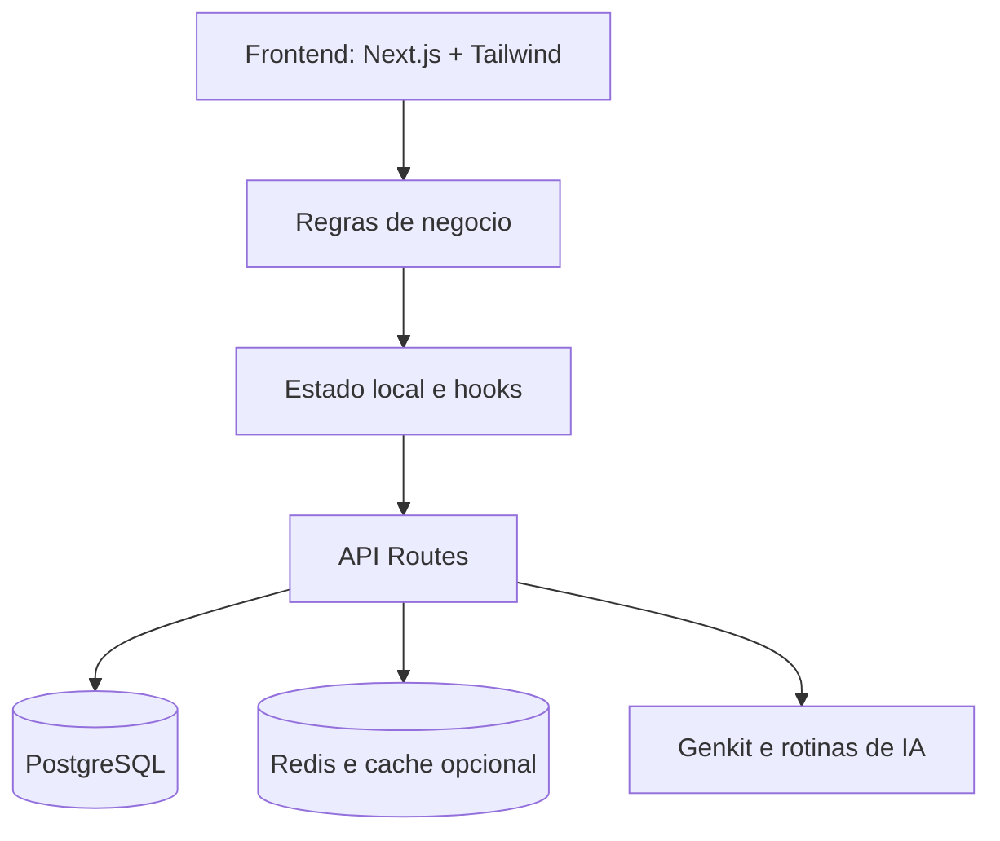

# Arquitetura do Sistema: Inventario Agil

Este documento resume a estrutura tecnica do `Inventario Agil` e os principais fluxos de operacao.

## Visao geral

O sistema segue uma separacao simples entre interface, regras de negocio e persistencia:

## Componentes principais

### Frontend

- Next.js App Router para paginas operacionais e administrativas
- React + TypeScript para as telas
- Hooks e componentes compartilhados para auth, branding e operacao

### Backend

- Rotas em `src/app/api/*`
- Autenticacao por sessao
- Isolamento multi-tenant por `tenant_id`
- Regras operacionais aplicadas no servidor para pedidos, picking e producao

### Persistencia

- PostgreSQL como fonte principal de dados
- Redis opcional para cache e sinais de atualizacao

## Multi-tenant

O isolamento principal continua sendo feito por `tenant_id` no banco e na sessao autenticada.

Pontos importantes:
- login e plataforma administrativa sao separados
- tenants podem ter `login_domains` para facilitar o roteamento correto no login
- a seguranca continua baseada em sessao + `tenant_id`, nao apenas no dominio informado

## Fluxo operacional

### Pedidos

O pedido nasce em `/orders`, onde o usuario define cliente, itens e o tipo operacional do pedido.

Cada pedido agora possui `operation_mode` proprio:
- `QUANTITY`
- `WEIGHT`
- `BOTH`

Essa escolha faz parte do proprio pedido e nao depende de uma preferencia global do tenant ou do navegador.

### Picking

O fluxo de picking le o `operation_mode` do pedido selecionado:
- `QUANTITY`: foco em quantidade separada
- `WEIGHT`: foco em peso separado
- `BOTH`: exige quantidade e peso

Quando houver `requested_weight`, esse valor aparece como referencia visual do item.

### Producao

As tarefas de producao tambem respeitam o `operation_mode` do pedido de origem:
- `QUANTITY`: exige quantidade produzida
- `WEIGHT`: exige peso produzido
- `BOTH`: exige ambos

O `requested_weight` do item pode aparecer como referencia visual na tarefa.

## Modelo de dados

As tabelas mais relevantes para essa feature sao:

- `orders`
  - `tenant_id`
  - `status`
  - `operation_mode`

- `order_items`
  - `order_id`
  - `material_id`
  - `qty_requested`
  - `requested_weight`

- `production_tasks`
  - referencia o item e o pedido de origem para aplicar o modo correto

Outras tabelas importantes no produto:
- `mrp_suggestions`
- `inventory_receipts`
- `site_settings`
- `tenant_login_domains`

## Performance e escalabilidade

O sistema usa tecnicas simples para manter boa resposta no uso diario:
- consultas filtradas por `tenant_id`
- carregamento paralelo nas paginas criticas
- cache de curta duracao para dados de alta frequencia

## Seguranca e autenticacao

As rotas protegidas combinam:
- middleware
- validacao server-side
- verificacao de sessao no App Shell

Isso evita exibir conteudo privado antes do redirecionamento para login.

## Resumo da feature "Tipo do pedido"

O tipo operacional e uma capacidade padrao do aplicativo, disponivel para qualquer tenant.

Resumo:
- a escolha acontece por pedido
- o backend continua suportando `WEIGHT`
- `BOTH` adiciona o peso solicitado no item
- `Pedidos`, `Picking` e `Producao` mostram e respeitam esse contexto
