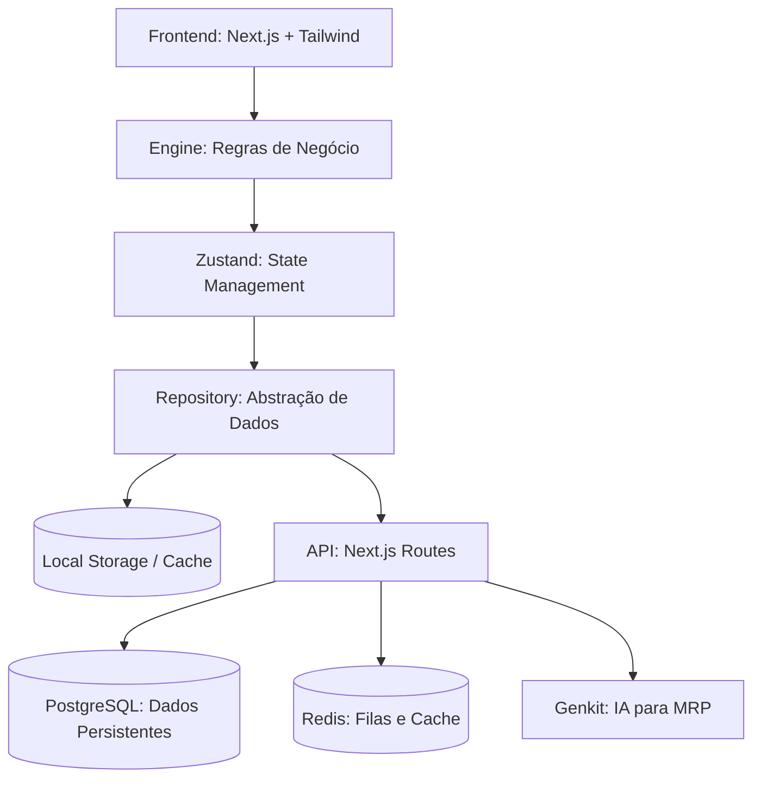
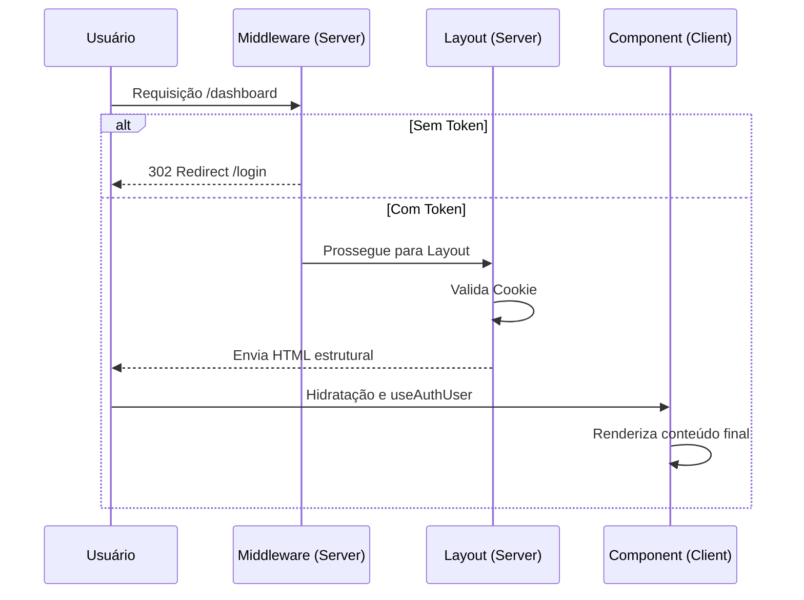

# Arquitetura do Sistema: Inventário Ágil

Este documento detalha o design e a estrutura técnica por trás do **Inventário Ágil**. O sistema foi concebido para ser altamente responsivo, suportar operações offline-first (em certas camadas) e permitir uma transição suave para um backend cloud.

## 🏗 Visão Geral da Arquitetura

O sistema segue uma abordagem de **Clean Architecture** mínima, desacoplando a lógica de negócio (Engine) da persistência de dados (Repositories/Contracts).

### Diagrama de Blocos

## 🛠 Componentes Principais

### 1. Camada de Contratos (`src/lib/pilot/contracts.ts`)
Define as interfaces para todas as entidades (Material, Order, Stock, etc.). Isso permite que a UI não precise saber se os dados vêm de uma API ou de um banco local.

### 2. Motor de Reservas (Reservations Engine)
Implementa a lógica de reserva "soft" e "hard".
- **Soft Reservation**: Ocorre no `blur` de um campo de quantidade no pedido.
- **TTL (Time to Live)**: Reservas expiram em 5 minutos se não houver atividade (heartbeat).
- **Consistência**: Garante que o `available` estoque seja calculado em tempo real: `onHand - reservedTotal`.

### 3. MRP (Material Requirements Planning)
Utiliza IA (via Genkit/Gemini) para analisar:
- Histórico de consumo das últimas 4 semanas.
- Lead time dos materiais.
- Estoque atual vs. Ponto de pedido.
- **Fluxo**: IA gera sugestões -> Gestor revisa -> Ordem de Produção é criada.

### 4. Fluxo de Produção para Estoque (IN/OUT)
Separamos a conclusão da produção da entrada física no estoque:
1. **Produção**: Operador conclui a tarefa.
2. **Receipt DRAFT**: O sistema gera um documento de entrada pendente.
3. **Alocação**: O operador de entrada (Inbox) confirma a entrada e decide se a quantidade deve ser auto-alocada para pedidos em espera (`READY_FULL` / `READY_PARTIAL`).

## 📊 Modelo de Dados (PostgreSQL)

Atualmente gerenciado via tabelas para:
- `mrp_suggestions`: Armazena insights da IA.
- `inventory_receipts`: Controle de entradas.
- `production_tasks`: Gerenciamento de fila de fábrica.

## 🌐 Camada SaaS & Marketing

O sistema evoluiu para uma estrutura SaaS (Software as a Service) com suporte a multi-branding e páginas institucionais:

- **Site Branding**: Gerenciado dinamicamente via `useSiteBranding()` e tabela `site_settings`. Permite personalizar o nome da empresa e logo sem alteração de código.
- **Landing Page**: Implementada no `src/app/page.tsx` com componentes modulares para marketing (Hero, Features, Pricing).
- **Roadmap & Security**: Páginas dedicadas para transparência técnica e retenção de leads B2B.

---

## 🔐 Segurança e Autenticação

O sistema utiliza uma estratégia de **Zero-Flash Auth Redirection** para garantir uma experiência de usuário premium e proteger rotas privadas.

### Prevenção de "Flash" de Conteúdo
Para evitar que partes da interface protegida apareçam antes do redirecionamento para o login, utilizamos três camadas de proteção:

1.  **Middleware (Edge Level)**: Localizado em `src/middleware.ts`, intercepta a requisição antes que ela chegue ao navegador. Se o token de sessão estiver ausente, o Next.js redireciona instantaneamente no lado do servidor.
2.  **Server-Side Layout Guard**: Todos os `layout.tsx` de rotas protegidas verificam a presença do cookie de sessão. Por serem *Server Components*, eles bloqueiam a renderização de qualquer HTML se o usuário não estiver autenticado, executando um `redirect()` imediato.
3.  **AppShell Validation**: No lado do cliente, o componente `AppShell` mantém o estado de `authLoading` e não renderiza os `children` até que a validação da sessão seja confirmada pelo hook `useAuthUser`.

### Fluxo de Acesso

---
## 🚀 Estratégia de Deploy

---
Consulte o arquivo [blueprint.md](./blueprint.md) para os requisitos originais de design.
